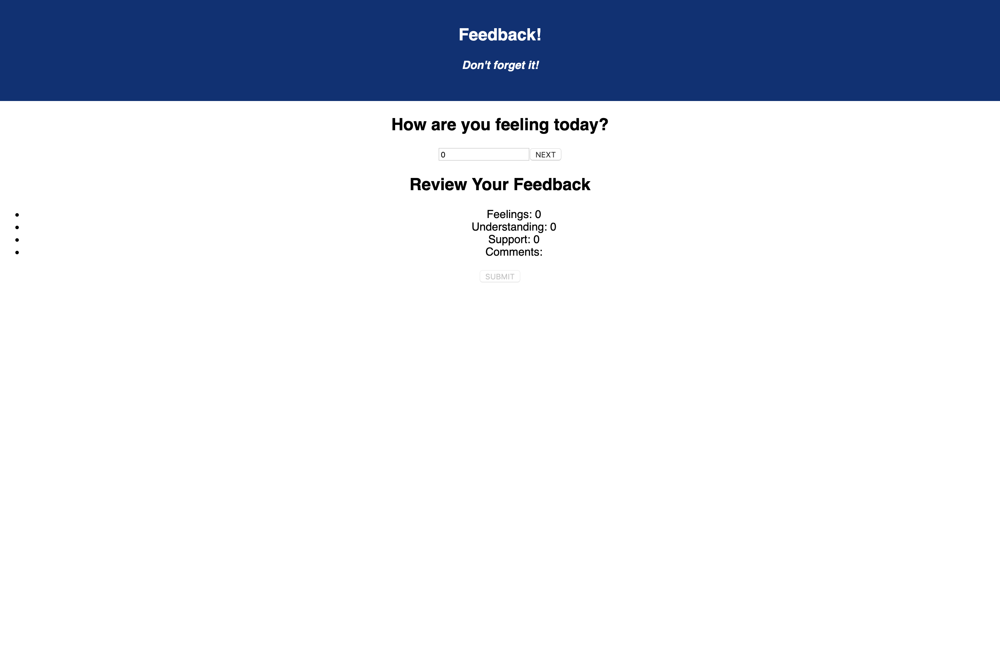

# Feedback Survey

Feedback survey is a web application that allows a user to fill out different forms with a rating of how they are feeling with new content, understanding the new content, how supported they feel, and any comments they would like to say.

## Built With

React.js, Redux, JavaScript, Node.js, Express.js, SQL, Postgres.

## Getting Started

### Prerequisites

- Node.js
- Reach.js
- Express.js
- Postgres

### Installing

1. Download or clone repo.
2. `npm install`
3. `npm start server` in one terminal window
4. `npm run client` in another terminal window

## Screen Shot

### Completed Features

- Multi-page form to collect user data
- How the user is feeling
- How well the user is understanding
- How supported the user feels
- Any comments the user has
- POST route created
- Thank you page and restart button

### Next Steps

- Ann an admin page to see survey submissions
- Use Material UI to style